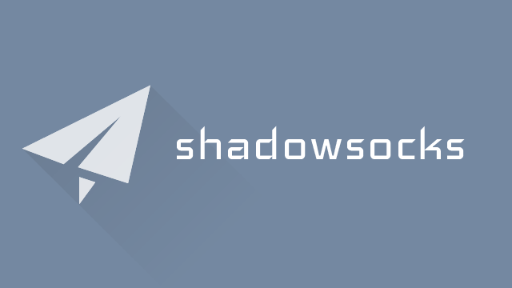

  
[](https://gitlab.com/yiguihai/ss/-/commits/dev)  
**不支持Centos**  
### 使用方法
安装脚本
```Shell
wget --no-check-certificate -O /usr/local/bin/ss-main 'https://gitlab.com/yiguihai/ss/-/raw/dev/usr/bin/ss-main'
chmod +x /usr/local/bin/ss-main
```
安装脚本(CDN)
```Shell
wget --no-check-certificate -O /usr/local/bin/ss-main 'https://glcdn.githack.com/yiguihai/ss/-/raw/dev/usr/bin/ss-main'
chmod +x /usr/local/bin/ss-main
```
运行脚本
```Shell
ss-main
```
<details open>
  <summary>更新记录</summary>
  <table>
    <caption><i><b>2022-12-15 22:41:45</b></i></caption>
    <thead>
      <tr>
        <th>项目</th>
        <th>更新详情</th>
      </tr>
    </thead>
    <tbody>
      <tr><td><a href="https://quic.nginx.org">nginx-quic</a></td><td><a href="https://hg.nginx.org/nginx-quic/rev/c38588d8376b">release-1.23.3 tag</a></td></tr>
<tr><td><a href=usr/app>kcptun-android</a></td><td><a href=https://github.com/shadowsocks/kcptun-android/commit/4912c48c99c9678ba0490ee1488a38a7b8ce5b1c>Update VPN flag</a></td></tr>
<tr><td>php</td><td><a href="https://www.php.net/downloads.php">php-8.2.0</a></td></tr>
<tr><td>shadowsocks-rust</td><td><a href=https://github.com/shadowsocks/shadowsocks-rust/commit/d8938ac39f08d4dff528a4472e093e870bd06010>fix local-dns compile error</a></td></tr>
<tr><td>v2ray</td><td><a href=https://github.com/v2fly/v2ray-core/commit/810d78120f4b06c7c52d455f0ec2487914bdec5a>Chore: bump github.com/go-chi/chi/v5 from 5.0.7 to 5.0.8 (#2202)</a></td></tr>
<tr><td>v2ray</td><td><a href=https://github.com/v2fly/v2ray-core/commit/a1ee432d290598a6bc85de11281b6c97573310aa>Chore: bump github.com/stretchr/testify from 1.8.0 to 1.8.1 (#2100)</a></td></tr>
<tr><td>v2ray</td><td><a href=https://github.com/v2fly/v2ray-core/commit/f8ac919d6674849096d5b59a576a6ec41cc04554>[app/dns] Support per-client configuration for fakedns (#2212)</a></td></tr>
    </tbody>
  </table>
</details>
