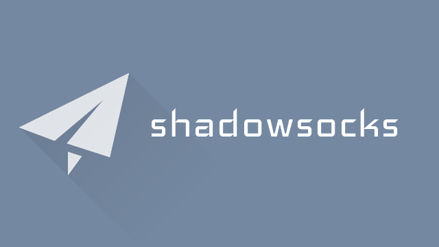

  
[](https://gitlab.com/yiguihai/ss/-/commits/dev)  
**不支持Centos**  
### 使用方法
安装脚本
```Shell
wget --no-check-certificate -O /usr/local/bin/ss-main 'https://gitlab.com/yiguihai/ss/-/raw/dev/usr/bin/ss-main'
chmod +x /usr/local/bin/ss-main
```
安装脚本(CDN)
```Shell
wget --no-check-certificate -O /usr/local/bin/ss-main 'https://glcdn.githack.com/yiguihai/ss/-/raw/dev/usr/bin/ss-main'
chmod +x /usr/local/bin/ss-main
```
运行脚本
```Shell
ss-main
```
<details open>
  <summary>更新记录</summary>
  <table>
    <caption><i><b>2022-07-25 23:44:28</b></i></caption>
    <thead>
      <tr>
        <th>项目</th>
        <th>更新详情</th>
      </tr>
    </thead>
    <tbody>
      <tr><td>shadowsocks-rust</td><td><a href=https://github.com/shadowsocks/shadowsocks-rust/commit/5ba94dcf531077f61bc63ebc0a51cc460254775f>Bump etherparse from 0.11.0 to 0.12.0</a></td></tr>
    </tbody>
  </table>
</details>
